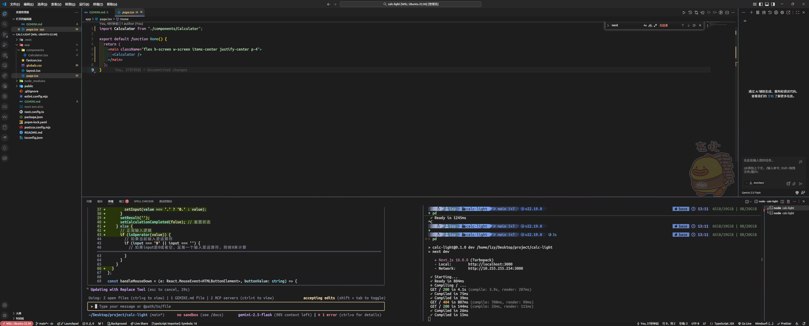

## 第一节课：Vibe Coding 基础认知

### 1. 描述下 MVP 场景描述

根据 `GEMINI.md` 文档，MVP 场景描述如下：

- **核心功能：** 提供基本的算术运算（加、减、乘、除）、数字输入和显示、清除/重置功能。
- **响应式用户界面：** 在不同屏幕尺寸上可用且视觉效果一致。
- **关键差异化功能：** 按钮按下时具有交互式光影效果，灵感来自 ColorOS 16 的“光场设计”，包括精致的光边缘、渐变模糊和光晕效果。

### 2. 工作流设计思路

我的工作流设计思路遵循迭代开发和用户反馈驱动的原则：

1.  **理解需求：** 仔细阅读 MVP 文档和用户提出的具体需求。
2.  **分析现有代码：** 了解其技术栈（Next.js, React, Tailwind CSS）和样式实现方式。
3.  **制定初步方案：** 根据需求和代码分析，制定实现方案。
4.  **逐步实现与验证：**
    - **小步快跑：** 将复杂需求分解为更小的、可管理的任务。。
    - **利用 Tailwind CSS：** 优先使用 Tailwind CSS 类进行样式修改，以保持代码一致性。对于复杂或动态的样式，结合内联 `style` 和 CSS 变量。
    - **处理动态交互：** 使用 `onMouseDown`, `onMouseUp`, `onMouseMove`, `onMouseEnter`, `onMouseLeave` 等事件监听器来捕获用户交互，并更新组件状态。
    - **状态管理：** 使用 `useState` 状态，驱动 UI 变化。
    - **性能考量：** 尽量优化计算过程，避免不必要的重渲染。
5.  **文档更新：** 记录关键决策和实现细节。

### 3. AI 生成的代码样板截图或链接

